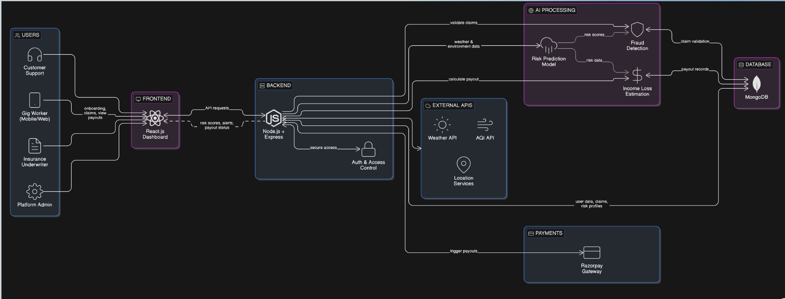

# Guidewire_hackathon

🚀 GigShield AI
AI-Powered Parametric Insurance for Gig Delivery Workers

🏆 Hackathon Project – Guidewire DEVTrails 2026
👨‍💻 Team: Semicolon
🎓 GLA University, Mathura

📌 Table of Contents

Introduction

Problem Statement

💡 Solution Overview

⚙️ System Architecture

🔄 Workflow

🎯 Demo Scenario

📊 Market Opportunity

🏆 Competitive Advantage

💰 Business Model

🧠 Tech Stack 

📌 Conclusion

📖 Introduction

The gig economy is rapidly growing in India, with millions of workers relying on daily earnings. However, their income is highly vulnerable to:

🌧️ Weather disruptions

🌫️ Air pollution

🚫 City restrictions

👉 Enter GigShield AI

An AI-powered parametric insurance platform that:

Predicts risks using real-time data

Automatically triggers claims

Instantly pays workers — no paperwork required

⚠️ Problem Statement

Gig workers frequently lose income due to:

Heavy rain / floods

Extreme heat

High AQI (pollution)

Curfews / strikes

❌ No reliable system exists for real-time income protection
❌ Traditional insurance is slow & manual

💡 Solution Overview
1️⃣ AI-Based Risk Prediction

Uses weather + AQI + city alerts

Predicts disruption probability

Dynamically adjusts premiums

2️⃣ Automatic Parametric Claim System

Trigger condition:

Rainfall / AQI crosses threshold

Claims are:

✅ Automatic

✅ Paperless

✅ Instant

3️⃣ Income Protection Engine

Calculates:

Lost working hours

Average earnings

Determines payout instantly

⚙️ System Architecture

📌 (Insert Architecture Diagram Image Here)
👉 
🔄 System Workflow

📌 

🎯 Demo Scenario

Step-by-step execution:

Weekly premium calculated

Heavy rain detected via API 🌧️

Worker unable to deliver

System calculates income loss

Claim auto-approved ✅

Instant payout 💸

📌 (Insert Demo Diagram Here)

📊 Market Opportunity

🇮🇳 8+ million gig workers in India

Expected growth: 23+ million by 2030

~25% face income disruption

💡 Huge gap in:

Micro-insurance

Real-time protection

🏆 Competitive Advantage
🔥 For Workers

Instant payouts 💸

No paperwork 📄❌

Affordable premiums

🤖 AI-Driven Intelligence

Predicts risks BEFORE loss

Dynamic pricing

Real-time monitoring

🏢 For Insurance Providers

Reduced operational cost

Fraud detection

Scalable across cities

⚔️ Competitor Analysis
❌ Traditional Insurance

Manual claims

Slow payouts

No prediction

⚠️ Indirect Competitors

Swiggy/Zomato insurance → Limited coverage

Govt schemes → Slow & limited

💰 Business Model

Weekly premium from gig workers

AI-based dynamic pricing

Commission via payment gateway

Scalable B2B2C model

📌 (Insert Business Model Diagram Here)

🧠 Tech Stack (Customize if needed)

AI/ML → Risk Prediction

APIs → Weather & AQI data

Backend → Node.js / Express

Payments → Razorpay

Database → MongoDB / SQL

📌 Conclusion

GigShield AI solves a real-world problem by combining:

AI

Automation

Parametric Insurance

🎯 Result:

Financial security for gig workers

Instant claim processing

Scalable insurance innovation

🙏 Thank You

“Building financial safety nets for the backbone of the gig economy.”
